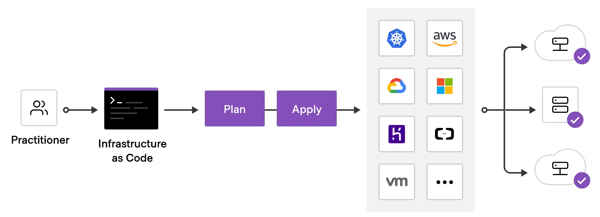

# Terraform Certification Learning

Infrastructure as Code (IaC) tools allow you to manage infrastructure with configuration files rather than through a graphical user interface. IaC allows you to build, change, and manage your infrastructure in a safe, consistent, and repeatable way by defining resource configurations that you can version, reuse, and share

Terraform is HashiCorp's infrastructure as code tool. It lets you define resources and infrastructure in human-readable, declarative configuration files, and manages your infrastructure's lifecycle. Using Terraform has several advantages over manually managing your infrastructure

- Terraform can manage infrastructure on multiple cloud platforms.
- The human-readable configuration language helps you write infrastructure code quickly.
- Terraform's state allows you to track resource changes throughout your deployments.
- You can commit your configurations to version control to safely collaborate on infrastructure.

## Manage any infrastructure

Terraform plugins called providers let Terraform interact with cloud platforms and other services via their application programming interfaces (APIs). HashiCorp and the Terraform community have written over 1,000 providers to manage resources on Amazon Web Services (AWS), Azure, Google Cloud Platform (GCP), Kubernetes, Helm, GitHub, Splunk, and DataDog, just to name a few. Find providers for many of the platforms and services you already use in the Terraform Registry. If you don't find the provider you're looking for, you can write your own.

## Standardize your deployment workflow

Providers define individual units of infrastructure, for example compute instances or private networks, as resources. You can compose resources from different providers into reusable Terraform configurations called modules, and manage them with a consistent language and workflow.

Terraform's configuration language is declarative, meaning that it describes the desired end-state for your infrastructure, in contrast to procedural programming languages that require step-by-step instructions to perform tasks. Terraform providers automatically calculate dependencies between resources to create or destroy them in the correct order.

To deploy infrastructure with Terraform:

- **Scope** - Identify the infrastructure for your project.
- **Author** - Write the configuration for your infrastructure.
- **Initialize** - Install the plugins Terraform needs to manage the infrastructure.
- **Plan** - Preview the changes Terraform will make to match your configuration.
- **Apply** - Make the planned changes.

## Track your infrastructure

Terraform keeps track of your real infrastructure in a state file, which acts as a source of truth for your environment. Terraform uses the state file to determine the changes to make to your infrastructure so that it will match your configuration.

## Collaborate

Terraform allows you to collaborate on your infrastructure with its remote state backends. When you use HCP Terraform (free for up to five users), you can securely share your state with your teammates, provide a stable environment for Terraform to run in, and prevent race conditions when multiple people make configuration changes at once.

You can also connect HCP Terraform to version control systems (VCSs) like GitHub, GitLab, and others, allowing it to automatically propose infrastructure changes when you commit configuration changes to VCS. This lets you manage changes to your infrastructure through version control, as you would with application code.

## Lock and upgrade provider versions

Terraform providers manage resources by communicating between Terraform and target APIs. Whenever the target APIs change or add functionality, provider maintainers may update and version the provider.

When multiple users or automation tools run the same Terraform configuration, they should all use the same versions of their required providers. There are two ways for you to manage provider versions in your configuration.

Specify provider version constraints in your configuration's terraform block.
Use the dependency lock file
If you do not scope provider version appropriately, Terraform will download the latest provider version that fulfills the version constraint. This may lead to unexpected infrastructure changes. By specifying carefully scoped provider versions and using the dependency lock file, you can ensure Terraform is using the correct provider version so your configuration is applied consistently.

Create a S3 bucket from an initialized Terraform configuration. Then, you will update the Terraform dependency lock file to use the latest version of the AWS provider, and edit the Terraform configuration to conform to the new provider version's requirements. Refer to the below offical terraform article link for refrence.

[Lock and Upgrade Provider Versions tutorial](https://developer.hashicorp.com/terraform/tutorials/configuration-language/provider-versioning).  